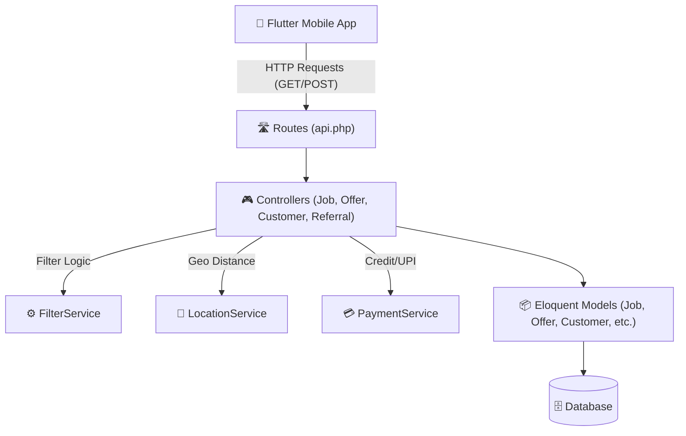
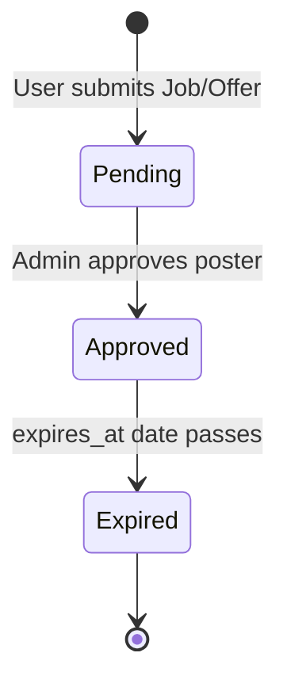

# 📘 Postergali API Contract & Architecture Guide

A comprehensive, beginner-friendly guide to the Postergali backend architecture and complete API specifications.

---

## 🏛️ 1. Simplified Architecture (For Beginners)

If you are new to backend systems or mobile-backend integration, think of Postergali as a restaurant:
1. **The Client (Flutter App / Web)** = *The Customer* making orders.
2. **API Routes (`routes/api.php`)** = *The Menu & Order Desk* directing requests to the right kitchen station.
3. **Controllers (`app/Http/Controllers/API`)** = *The Waiters* who take orders, check inputs, and ask the kitchen to prepare the response.
4. **Services (`app/Services`)** = *The Chefs* doing the heavy lifting (calculating distances, filtering data, processing payments).
5. **Models (`app/Models`)** = *The Recipe Books & Shelves* representing database tables (`jobs`, `offers`, `customers`, `referrals`).
6. **Database (MySQL / SQLite)** = *The Pantry* where data is stored persistently.



---

## 🔄 2. Core Business Workflows

### A. Geolocation & Radius Search (Jobs & Offers)
- When a user opens the app, the app sends GPS coordinates (`latitude`, `longitude`) and a `radius` (default 5 km).
- The backend uses the **Haversine formula** to calculate distance between the user and every poster. Only posters within that circle are returned.

### B. Poster Approval & Expiry Lifecycle

- A poster starts in `pending` status.
- Once approved by an Admin in the dashboard, `status` becomes `approved`, `approved_at` is set, and `expires_at` is calculated based on the selected plan duration (e.g. 30 days).
- The public search/index APIs **only return active, approved, unexpired** posters.

### C. Customer Wallet & Referral Bonus
- When a customer checks in (`GET /api/v1/customers/check`), their account is registered and they automatically receive **1,000 welcome credits**.
- Customers can submit up to 5 referrals (`POST /api/v1/referrals`).
- When posting a job/offer, customers can pay using **Full UPI**, **Full Referral Credit**, or **Semi (Partial UPI + Partial Credit)**.

---

## 📑 3. API Conventions & Standards

- **Base URL**: `http://<your-server-ip-or-domain>/api/v1`
- **Headers**:
  - `Accept: application/json`
  - `Content-Type: application/json` (or `multipart/form-data` for file uploads)
- **Standard Response Envelope**:
  - Success: `{ "success": true, "data": [...] }`
  - Error: `{ "success": false, "message": "...", "errors": {...} }`

---

## 📡 4. Complete API Endpoints Contract

---

### 💼 Jobs Endpoints

#### 1. List Nearby Jobs (Filtered)
Retrieve jobs within a radius from the user's location with optional multi-filtering.

- **Method**: `GET`
- **Path**: `/api/v1/jobs`
- **Query Parameters**:

| Parameter | Type | Required | Description / Example |
|---|---|---|---|
| `latitude` | float | **Yes** | User's latitude (e.g. `28.5914`) |
| `longitude` | float | **Yes** | User's longitude (e.g. `77.4021`) |
| `radius` / `distance` | float | No | Search radius in km (Default: `5`, Max: `100`) |
| `sub_categories` | string / array | No | Comma-separated or list (e.g. `Food and Hospitality,Delivery and Logistics`) |
| `is_expiry` / `expiry` | string | No | Expiry window (`within_a_day`, `within_3_days`, `within_a_week`) |
| `job_types` / `job_type` | string / array | No | Type of job (`Full-time`, `Part-Time`, `Temporary`) |
| `salary` | string | No | Salary range (`less_than_10000`, `less_than_20000`, `21000_and_above`) |
| `page` | integer | No | Page number for pagination (Default: `1`) |
| `per_page` | integer | No | Items per page (Default: `50`, Max: `200`) |

- **Success Response (`200 OK`)**:
```json
{
  "success": true,
  "data": [
    {
      "id": 101,
      "temp_id": "job_abc123",
      "business_name": "Cafe Mocha",
      "job_role": "Barista",
      "job_type": "Full-time",
      "salary": 18000,
      "phone_number": "9876543210",
      "city": "Noida",
      "latitude": 28.5914,
      "longitude": 77.4021,
      "status": "approved",
      "view_count": 12,
      "distance": 1.25,
      "created_at": "2026-08-29T10:00:00.000000Z",
      "expires_at": "2026-09-28T10:00:00.000000Z"
    }
  ],
  "pagination": {
    "total": 1,
    "per_page": 50,
    "current_page": 1,
    "last_page": 1,
    "from": 1,
    "to": 1
  },
  "radius_km": 5
}
```

---

#### 2. Search Jobs
Search jobs by device ID, phone number, or location.

- **Method**: `GET`
- **Path**: `/api/v1/jobs/search`
- **Query Parameters**:
  - `phone_number` / `mobile_number` (string)
  - `device_id` (string)
  - `latitude`, `longitude`, `radius` / `distance` (optional for geo-filtered search)
  - Same filter params: `sub_categories`, `is_expiry`, `job_type`, `salary`

---

#### 3. Post a Job (Create)
Submit a new job vacancy poster.

- **Method**: `POST`
- **Path**: `/api/v1/jobs`
- **Content-Type**: `application/json`
- **Request Body**:
```json
{
  "temp_id": "temp-job-001",
  "device_id": "device_xyz_999",
  "device_os": "android",
  "master_category": "Services",
  "subcategory": "Food and Hospitality",
  "business_name": "Royal Cafe",
  "job_role": "Head Chef",
  "job_type": "Full-time",
  "salary": 25000,
  "phone_number": "9876543210",
  "latitude": 28.5914,
  "longitude": 77.4021,
  "city": "Noida",
  "plan_id": "plan_30days",
  "payment_type": "full_credit",
  "customer_id": "CUST_9876543210"
}
```
- **Success Response (`201 Created`)**:
```json
{
  "id": 102,
  "temp_id": "temp-job-001",
  "business_name": "Royal Cafe",
  "job_role": "Head Chef",
  "job_type": "Full-time",
  "status": "pending",
  "created_at": "2026-08-29T15:00:00.000000Z"
}
```

---

#### 4. Get Job Details (Single)
- **Method**: `GET`
- **Path**: `/api/v1/jobs/{id}`
- **Success Response (`200 OK`)**: Automatically increments `view_count` and returns the job object.

---

### 🏷️ Offers Endpoints

#### 1. List Nearby Offers (Filtered)
Retrieve promotional offers/discounts within a radius with multi-filtering.

- **Method**: `GET`
- **Path**: `/api/v1/offers`
- **Query Parameters**:

| Parameter | Type | Required | Description / Example |
|---|---|---|---|
| `latitude` | float | **Yes** | User's latitude |
| `longitude` | float | **Yes** | User's longitude |
| `radius` / `distance` | float | No | Search radius in km (Default: `5`) |
| `sub_categories` | string / array | No | Filter subcategories (e.g. `Electronics,Clothing`) |
| `is_expiry` / `expiry` | string | No | Expiry window (`within_a_day`, `within_3_days`, `within_a_week`) |
| `offer_types` / `offer_type`| string / array | No | Offer type (e.g. `discount`, `combo`, `bogo`) |

- **Success Response (`200 OK`)**:
```json
{
  "success": true,
  "data": [
    {
      "id": 50,
      "temp_id": "offer_xyz123",
      "business_name": "Pizza Corner",
      "offer_details": "Flat 50% off on all medium pizzas",
      "offer_type": "discount",
      "mobile_number": "9876543210",
      "latitude": 28.5914,
      "longitude": 77.4021,
      "status": "approved",
      "view_count": 85,
      "distance": 0.82,
      "media": {
        "images": ["offers/images/pizza1.jpg"],
        "video": null
      }
    }
  ],
  "pagination": {
    "total": 1,
    "per_page": 50,
    "current_page": 1,
    "last_page": 1,
    "from": 1,
    "to": 1
  },
  "radius_km": 5
}
```

---

#### 2. Search Offers
- **Method**: `GET`
- **Path**: `/api/v1/offers/search`
- **Query Parameters**: `device_id`, `mobile_number`, `phone_number`, `latitude`, `longitude`, `radius`

---

#### 3. Post an Offer (Create with Images/Video)
- **Method**: `POST`
- **Path**: `/api/v1/offers`
- **Content-Type**: `multipart/form-data`
- **Form Fields**:
  - `business_name` (string)
  - `offer_details` (string)
  - `offer_type` (string)
  - `subcategory` (string)
  - `mobile_number` (string)
  - `latitude` (float), `longitude` (float), `city` (string)
  - `plan_id` (string)
  - `images[]` (file, optional multiple)
  - `video` (file, optional)
  - `customer_id`, `payment_type` (optional)

---

### 👤 Customer & Referral Endpoints

#### 1. Check Customer & Auto-Create Wallet
- **Method**: `GET`
- **Path**: `/api/v1/customers/check?mobile=9876543210&fcm=fcm_token_here`
- **Description**: If customer does not exist, creates customer profile and adds **1,000 initial bonus credits**. If customer exists, returns their credit balance.
- **Success Response (`200 OK` / `201 Created`)**:
```json
{
  "success": true,
  "created": false,
  "customer_id": "CUST_9876543210",
  "mobile": "9876543210",
  "balance": 1000,
  "fcm": "fcm_token_here"
}
```

---

#### 2. Get Customer's Created Ads
- **Method**: `GET`
- **Path**: `/api/v1/customers/poster-ads?mobile=9876543210`
- **Success Response (`200 OK`)**:
```json
{
  "success": true,
  "customer_id": "CUST_9876543210",
  "mobile": "9876543210",
  "jobs": [...],
  "offers": [...]
}
```

---

#### 3. Submit Referrals
Submit up to 5 referral phone numbers to earn credits.

- **Method**: `POST`
- **Path**: `/api/v1/referrals`
- **Request Body**:
```json
{
  "referrer_name": "Rahul Sharma",
  "referrer_mobile": "9876543210",
  "referrals": [
    { "referral_name": "Amit Kumar", "referral_mobile": "9876543211" },
    { "referral_name": "Sunil Verma", "referral_mobile": "9876543212" }
  ]
}
```
- **Success Response (`201 Created`)**:
```json
{
  "success": true,
  "message": "Referrals saved successfully."
}
```

---

#### 4. Check Referral Status
- **Method**: `GET`
- **Path**: `/api/v1/referrals/check?mobile=9876543211`
- **Success Response (`200 OK`)**:
```json
{
  "success": true,
  "found": true,
  "referral_name": "Amit Kumar",
  "referral_mobile": "9876543211",
  "referrer_name": "Rahul Sharma",
  "referrer_mobile": "9876543210",
  "status": "IN PROGRESS",
  "customer_id": "CUST_9876543210"
}
```

---

### 📋 Plans Endpoints

#### 1. List Subscription Plans
- **Method**: `GET`
- **Path**: `/api/v1/plans`
- **Success Response (`200 OK`)**:
```json
[
  {
    "id": 1,
    "plan_title": "Standard 30 Days",
    "duration": "30 days",
    "price": 499
  },
  {
    "id": 2,
    "plan_title": "Premium 60 Days",
    "duration": "60 days",
    "price": 899
  }
]
```

---

## 🎯 5. Quick Troubleshooting for Developers

| Problem | Cause | Solution |
|---|---|---|
| `422 Unsupported query filter parameter(s)` | An unrecognized query parameter was passed. | Ensure your query parameters match the allowed keys (`sub_categories`, `is_expiry`, `job_types`, `salary`, `distance`, `radius`). |
| Empty search results | Filters too restrictive or coordinates out of radius. | Check that `latitude`/`longitude` match active approved posters, or increase `radius=50`. |
| Job/Offer not appearing in app | Status is still `pending` or expired. | Ensure poster has `status = 'approved'` and `expires_at > now()`. |
| Multi-word filters failing | Splitting on spaces instead of commas. | Pass multi-select items joined by commas: `sub_categories=Food and Hospitality,Office and Admin`. |
